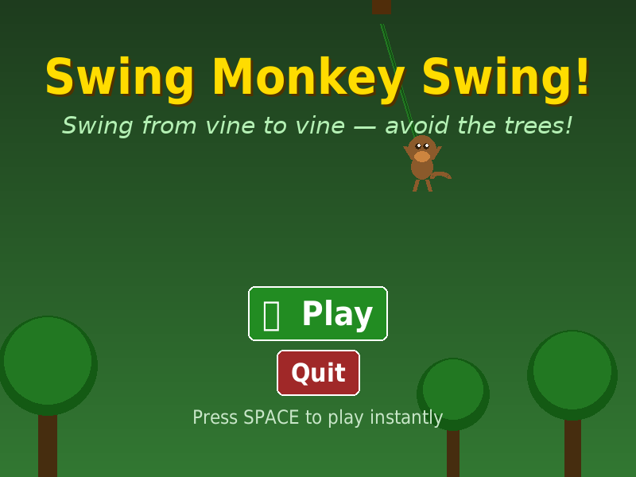
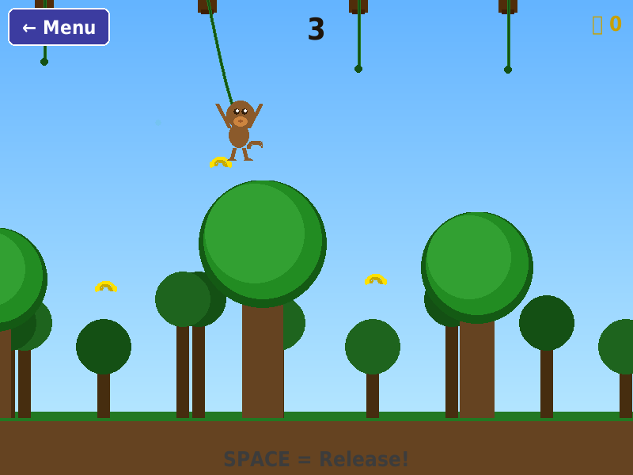

# Monkey Swing 🐒

A 2D monkey swing game built with Python and [Pygame](https://www.pygame.org/).

## Gameplay

Swing your monkey from vine to vine through a jungle!

- **SPACE** — start swinging / release the vine
- **ESC** — return to the main menu
- Collect 🍌 bananas for bonus points
- Avoid trees and the ground




## How to Play

1. The monkey starts hanging from a vine.
2. Press **SPACE** once to start the pendulum swing.
3. Watch the monkey swing back and forth.
4. Press **SPACE** again at the right moment to release — the monkey will fly through the air!
5. The monkey automatically grabs the next vine when it flies close enough.
6. The farther you go, the higher your score.
7. If the monkey falls to the ground or hits a tree, it's game over.
8. Press **SPACE** on the game-over screen to restart.

## Running the Game

```bash
pip install pygame
python main.py
```

## Project Structure

```
monkey-swing/
├── main.py               # Entry point
├── Misc.py               # Utility helpers (draw_text)
├── Scene/
│   ├── Scene.py          # Abstract base scene
│   ├── SceneHandler.py   # Scene transition manager
│   ├── MainScene.py      # Main menu
│   └── PlayScene.py      # Gameplay (swing mechanics, collision, score)
├── Components/
│   └── Button.py         # Reusable UI button
└── Sprites/
    ├── Monkey.py         # Monkey sprite with pendulum + free-flight physics
    ├── Obstacle.py       # Tree obstacle sprite
    └── Banana.py         # Collectible banana sprite
```

## Credits

Inspired by [SC0RPlON/Monkey-Swing-Game](https://github.com/SC0RPlON/Monkey-Swing-Game).  
All graphics are drawn programmatically with Pygame — no external asset files required.
